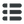
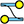
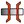
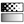
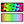
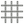
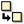

# SIF is Font

Code         |Glyph            |Icon Name    |Number       | Synfig Icon |
:------------ | :-------------: | :------------| :------------|----------|
0xe000 ||synfig-logo |1001 | 
0xe001 | |synfig-logo 2|1002| 
   | |  __INTERPOLATIONS__ |
0xe002 | |interpolation-clamped |2001 |
0xe003 | |interpolation-constant |2002 |
0xe004 | |interpolation-ease |2003 |
0xe005 | |interpolation-nonnamed |2004 |NA
0xe006 | |interpolation-tcb |2005 |
0xe007 | |interpolation-linear |2006 |
 | | __VALUES__ |
0xe009 | |value-angle |3001 |
0xe010 | |value-canvas |3002 |
0xe011 | |value-time |3003 |
0xe012 | |value-integer |3004 |
0xe013 | |value-string |3005 |
0xe014 | |value-list |3006 |
0xe013 | |value-vector |3007 |
0xe015 | |value-color |3008 |
0xe016 | |value-real |3009 |
0xe017 | |value-segment |3010 |
0xe018 | |value-splinepoint |3011 |
0xe019 | |value-bool |3012 |
0xe020 | |value-gradient |3013 |
 | | __DUCKS__ |
0xe019 | |duck-position |4001 |
0xe019 | |duck-vertex |4002 |
0xe019 | |duck-tangent |4003 |
0xe019 | |duck-radius |4004 |
0xe019 | |duck-width |4005 |
0xe019 | |duck-angle |4006 |
0xe019 | |duck-scale |4007 |NA
0xe019 | |duck-skew |4008 |NA
 | | __LAYERS__ |
0xe019 | |layer-blur-blur |5001 |
0xe019 | |layer-blur-motion |5002 |
0xe019 | |layer-blur-radial |5003 |
0xe019 | |layer-distortion-curvewarp |5004 |
0xe019 | |layer-distortion-insideot |5005 |
0xe019 | |layer-distortion-noise |5006 |
0xe019 | |layer-distortion-spherize |5007 |
0xe019 | |layer-distortion-stretch |5008 |
0xe019 | |layer-distortion-twirl |5009 |
0xe019 | |layer-distortion-warp |5010 |
0xe019 | |layer-example-filledrectangle |5011 |
0xe019 | |layer-example-metaballs |5012 |
0xe019 | |layer-example-simplecircle |5013 |
0xe019 | |layer-filter-clamp |5014 |
0xe019 | |layer-filter-colorcorrect |5015 |
0xe019 | |layer-filter-halftone2 |5016 |
0xe019 | |layer-filter-halftone3 |5017 |
0xe019 | |layer-filter-lumakey |5018 |
0xe019 | |layer-fractal-julia |5019 |
0xe019 | |layer-fractal-mandelbrot |5020 |
0xe019 | |layer-geometry-advancedoutline |5021 |
0xe019 | |layer-geometry-checkerboard |5022 |
0xe019 | |layer-geometry-circle |5023 |
0xe019 | |layer-geometry-outline |5024 |
0xe019 | |layer-geometry-polygon |5025 |
0xe019 | |layer-geometry-rectangle |5026 |
0xe019 | |layer-geometry-region |5027 |
0xe019 | |layer-geometry-solidcolor |5028 |
0xe019 | |layer-geometry-star |5029 |
0xe019 | |layer-gradient-conical |5030 |
0xe019 | |layer-gradient-curve |5031 |
0xe019 | |layer-gradient-linear |5032 |
0xe019 | |layer-gradient-noise |5033 |
0xe019 | |layer-gradient-radial |5034 |
0xe019 | |layer-gradient-spiral |5035 |
0xe019 | |layer-other-duplicate |5036 |
0xe019 | |layer-other-group |5037 |
0xe019 | |layer-other-plant |5038 |
0xe019 | |layer-other-skeleton |5039 |
0xe019 | |layer-other-sound |5040 |
0xe019 | |layer-other-stroboscope |5041 |
0xe019 | |layer-other-supersample |5042 |
0xe019 | |layer-other-switch |5043 |
0xe019 | |layer-other-text |5044 |
0xe019 | |layer-other-timeloop |5045 |
0xe019 | |layer-other-xorpattern |5046 |
0xe019 | |layer-other-image |5057 |
0xe019 | |layer-stylize-bevel |5048 |
0xe019 | |layer-stylize-shade |5049 |
0xe019 | |layer-transform-rotate |5050 |
0xe019 | |layer-transform-scale |5051 |
0xe019 | |layer-transform-translate |5052 |
 | | __TOOLS : Toolbox__ |
0xe019 | |toolbox-brush |6001 |
0xe019 | |toolbox-circle |6002 |
0xe019 | |toolbox-draw |6003 |
0xe019 | |toolbox-eyedrop |6004 |
0xe019 | |toolbox-fill |6005 |
0xe019 | |toolbox-gradient |6006 |
0xe019 | |toolbox-mirror |6007 |
0xe019 | |toolbox-transform |6008 |
0xe019 | |toolbox-polyline |6009 |
0xe019 | |toolbox-rectangle |6010 |
0xe019 | |toolbox-rotate |6011 |
0xe019 | |toolbox-scale |6012 |
0xe019 | |toolbox-sketch |6013 |
0xe019 | |toolbox-smoothmove |6014 |
0xe019 | |toolbox-spline |6015 |
0xe019 | |toolbox-star |6016 |
0xe019 | |toolbox-text |6017 |
0xe019 | |toolbox-linewidth |6018 |
0xe019 | |toolbox-zoom |6019 |
0xe019 | |toolbox-cutout |6020 |
 | | __PANELS__ |
0xe019 | |panel-toolbox |7001 |
0xe019 | |panel-parameters |7002 |
0xe019 | |panel-keyframes |7003 |
0xe019 | |panel-timetrack |7004 |
0xe019 | |panel-graphs |7005 |
0xe019 | |panel-library |7006 |
0xe019 | |panel-metadata |7007 |
0xe019 | |panel-canvases |7008 |
0xe019 | |panel-palette |7009 |
0xe019 | |panel-navigator |7010 |
0xe019 | |panel-info |7011 |
0xe019 | |panel-tooloptions |7012 |
0xe019 | |panel-history |7013 |
0xe019 | |panel-layers |7014 |
0xe019 | |panel-layersets |7015 |
 | | __TOOLS : Canvas Window__ |
0xe019 | |tool-seektobegin |8001 |
0xe019 | |tool-prevwaypoint |8002 |NA
0xe019 | |tool-prevkeyframe |8003 |
0xe019 | |tool-prevframe |8004 |
0xe019 | |tool-play |8005 |
0xe019 | |tool-nextframe |8006 |
0xe019 | |tool-nextwaypoint |8007 |
0xe019 | |tool-nextkeyframe |8008 |
0xe019 | |tool-nextwaypoint |8009 |NA
0xe019 | |tool-seektoend |8010 |
0xe019 | |tool-lockpastkeyframe |8011 |
0xe019 | |tool-unlockpastkeyframe |8012 |
0xe019 | |tool-lockfuturekeyframe |8013 |
0xe019 | |tool-unlockfuturekeyframe |8014 |
0xe019 | |tool-onnionskin |8015 |
0xe019 | |tool-gird |8016 |
0xe019 | |tool-snapgird |8017 |
0xe019 | |tool-guideline |8018 |
0xe019 | |tool-snapguideline |8019 |
0xe019 | |tool-jackaudio |8020 |
0xe019 | |tool-preview |8021 |
0xe019 | |tool-render |8022 |
0xe019 | |tool-animatemodeon|8023 |
0xe019 | |tool-animatemodeoff|8024 |
0xe019 | |tool-zoom|8025 |GTK+
0xe019 | |tool-zoomin|8026 |GTK+
0xe019 | |tool-zoomout|8027 |GTK+
0xe019 | |tool-zoom100|8028 |GTK+
0xe019 | |tool-zoomfit|8029 |GTK+
 | | __TOOLS : Keyframe Window__ |
0xe019 | |tool-keyframe|9001 |V
0xe019 | |tool-addkeyframe|9002 |GTK+
0xe019 | |tool-removekeyframe|9003 |GTK+
0xe019 | |tool-duplicatekeyframe|9004 |GTK+
0xe019 | |tool-keysettings|9005 |GTK+
xxxxxx | | __TOOLS : Parameter Window__ |
0xe019 | |tool-valuenode-link|1001 |
0xe008 | |tool-valuenode-forbidanimation |1002 |
 | | __TOOLS : Layer Window__ |
0xe019 | |tool-increaseammount|1101 |GTK+
0xe019 | |tool-decreaseamount |1102 |GTK+
0xe019 | |tool-addlayertoset |1103 |
0xe019 | |tool-removelayerfromset |1104 |
0xe019 | |tool-layerdescription |1105 |
0xe019 | |tool-copylayer |1106 |GTK+
0xe019 | |tool-pastelayer |1107 |GTK+
0xe019 | |tool-enablerender |1108 |NA
0xe019 | |tool-disablerender |1109 |NA
0xe019 | |tool-locklayer |1110 |NA
0xe019 | |tool-unlocklayer |1111 |NA
0xe019 | |tool-showlayer |1112 |NA
0xe019 | |tool-hidelayer |1113 |NA
0xe019 | |tool-deletelayer |1114 |GTK+
0xe019 | |tool-selectschildrenlayers |1115 |
0xe019 | |tool-duplicatelayer |1116 |
0xe019 | |tool-movelayerdown |1117 |GTK+
0xe019 | |tool-moveuplayer |1118 |GTK+
 | | __TOOLS : Global__ |
0xe019 | |tool-newdocument |1201 |
0xe019 | |tool-save |1202 |
0xe019 | |tool-saveall |1203 |
0xe019 | |tool-saveas |1204 |

