SIF Icon Font Matrix
----

Code         |Glyph            |Icon         |Number
------------ | :-------------: | ------------| ------------|
0xe000 | |Interpolation - Camped | 001 
0xe001 | |Interpolation - Constant |002
0xe002 |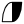 |Interpolation - Ease |003
0xe003 |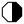 |Interpolation - Nonnamed |004
0xe004 |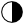 |Interpolation - TCB |005
0xe005 |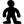 |Interpolation - Static |006
       |                                                           |Animation Mode - Off |007
0xe006 |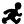 |Animation Mode - On |008
0xe007 | |Value Type - Angle |009
0xe008 | |Value Type - Canvas |010
0xe009 |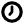 |Value Type - Time |011
0xe010 | |Value Type - Integer |012
0xe011 | |Value Type - String |013
0xe012 |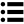 |Value Type - List |014
0xe013 |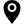 |Value Type - Vector |015
0xe014 |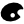 |Value Type - Color |016
0xe015 |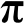 |Value Type - Real |017
0xe016 |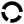 |Value Type - Segment |018
0xe017 |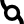 |Value Type - SplinePoint |019
0xe018 | |Value Type - Bool |020