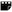

SIF Icon Font Matrix
----

 Code        |Glyph          |Icon         |Number
------------ | ------------- | ------------| ------------|
0xe000 | Interplator - Camped |Interpolation - Camped | 001 
0xe001 | Interplator - Constant  |Interpolation - Constant |002
0xe002 | Interplator - Ease  |Interpolation - Ease |003
0xe003 | Interplator - Nonnamed  |Interpolation - Nonnamed |004
0xe004 | Interplator - TCB  |Interpolation - TCB |005
0xe005 | Standing Figure  |Interpolation - Static |006
 | |Animation Mode - Off |007
0xe006 | Warkling Figure |Animation Mode - On |008
0xe007 | Angle |Value Type - Angle |009
0xe008 | Celluloid |Value Type - Canvas |010
0xe009 | Clock |Value Type - Time |011
0xe010 | Digital |Value Type - Integer |012
0xe011 | Double Quotes |Value Type - String |013
0xe012 | List |Value Type - List |014
0xe013 | Map Pin |Value Type - Vector |015
0xe014 | Paint Pallet |Value Type - Color |016
0xe015 | Pi |Value Type - Real |017
0xe016 | Segment |Value Type - Segment |018
0xe017 | Spline Point |Value Type - SplinePoint |019
0xe018 | Switch |Value Type - Bool |020