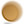
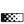

# SIF is Font

Code   | Glyph | Icon Name  | Number | Synfig Icon | FIS Icon |
:----- | :---: | :--------  | :------|-------------|----------|
0xe000 ||synfig-logo |01001 | 
0xe001 | |synfig-logo 2|01002| 
   | |  __INTERPOLATIONS__ |
0xe002 | |interpolation-clamped |02001 |
0xe003 | |interpolation-constant |02002 |
0xe004 | |interpolation-ease |02003 |
0xe005 | |interpolation-nonnamed |02004 |NA
0xe006 | |interpolation-tcb |02005 |
0xe007 | |interpolation-linear |02006 |
 | | __VALUES__ |
0xe009 | |value-angle |03001 |
0xe010 | |value-canvas |03002 |
0xe011 | |value-time |03003 |
0xe012 | |value-integer |03004 |
0xe013 | |value-string |03005 |
0xe014 | |value-list |03006 |
0xe013 | |value-vector |03007 |
0xe015 | |value-color |03008 |
0xe016 | |value-real |03009 |
0xe017 | |value-segment |03010 |
0xe018 | |value-splinepoint |03011 |
0xe019 | |value-bool |03012 |
0xe020 | |value-gradient |03013 |
 | | __DUCKS__ |
0xe019 | |duck-position |04001 |
0xe019 | |duck-vertex |04002 |
0xe019 | |duck-tangent |04003 |
0xe019 | |duck-radius |04004 |
0xe019 | |duck-width |04005 |
0xe019 | |duck-angle |04006 |
0xe019 | |duck-scale |04007 |NA
0xe019 | |duck-skew |04008 |NA
 | | __LAYERS__ |
0xe019 | |layer-blur-blur ||05001 |
0xe019 | |layer-blur-motion |05002 |
0xe019 | |layer-blur-radial |05003 |
0xe019 | |layer-distortion-curvewarp |05004 |
0xe019 | |layer-distortion-insideot |05005 |
0xe019 | |layer-distortion-noise |05006 |
0xe019 | |layer-distortion-spherize |05007 |
0xe019 | |layer-distortion-stretch |05008 |
0xe019 | |layer-distortion-twirl |05009 |
0xe019 | |layer-distortion-warp |05010 |
0xe019 | |layer-example-filledrectangle |05011 |
0xe019 | |layer-example-metaballs |05012 |
0xe019 | |layer-example-simplecircle |05013 |
0xe019 | |layer-filter-clamp |05014 |
0xe019 | |layer-filter-colorcorrect |05015 |
0xe019 | |layer-filter-halftone2 |05016 |
0xe019 | |layer-filter-halftone3 |05017 |
0xe019 | |layer-filter-lumakey |05018 |
0xe019 | |layer-fractal-julia |05019 |
0xe019 | |layer-fractal-mandelbrot |05020 |
0xe019 | |layer-geometry-advancedoutline |05021 |
0xe019 | |layer-geometry-checkerboard |05022 |
0xe019 | |layer-geometry-circle |05023 |
0xe019 | |layer-geometry-outline |05024 |
0xe019 | |layer-geometry-polygon |05025 |
0xe019 | |layer-geometry-rectangle |05026 |
0xe019 | |layer-geometry-region |05027 |
0xe019 | |layer-geometry-solidcolor |05028 |
0xe019 | |layer-geometry-star |05029 |
0xe019 | |layer-gradient-conical |05030 |
0xe019 | |layer-gradient-curve |05031 |
0xe019 | |layer-gradient-linear |05032 |
0xe019 | |layer-gradient-noise |05033 |
0xe019 | |layer-gradient-radial |05034 |
0xe019 | |layer-gradient-spiral |05035 |
0xe019 | |layer-other-duplicate |05036 |
0xe019 | |layer-other-group |05037 |
0xe019 | |layer-other-plant |05038 |
0xe019 | |layer-other-skeleton |05039 |
0xe019 | |layer-other-sound |05040 |
0xe019 | |layer-other-stroboscope |05041 |
0xe019 | |layer-other-supersample |05042 |
0xe019 | |layer-other-switch |05043 |
0xe019 | |layer-other-text |05044 |
0xe019 | |layer-other-timeloop |05045 |
0xe019 | |layer-other-xorpattern |05046 |
0xe019 | |layer-other-image |05057 |
0xe019 | |layer-stylize-bevel |05048 |
0xe019 | |layer-stylize-shade |05049 |
0xe019 | |layer-transform-rotate |05050 |
0xe019 | |layer-transform-scale |05051 |
0xe019 | |layer-transform-translate |05052 |
 | | __TOOLS : Toolbox__ |
0xe019 | |toolbox-brush |06001 |
0xe019 | |toolbox-circle |06002 |
0xe019 | |toolbox-draw |06003 |
0xe019 | |toolbox-eyedrop |06004 |
0xe019 | |toolbox-fill |06005 |
0xe019 | |toolbox-gradient |06006 |
0xe019 | |toolbox-mirror |06007 |
0xe019 | |toolbox-transform |06008 |
0xe019 | |toolbox-polyline |06009 |
0xe019 | |toolbox-rectangle |06010 |
0xe019 | |toolbox-rotate |06011 |
0xe019 | |toolbox-scale |06012 |
0xe019 | |toolbox-sketch |06013 |
0xe019 | |toolbox-smoothmove |06014 |
0xe019 | |toolbox-spline |06015 |
0xe019 | |toolbox-star |06016 |
0xe019 | |toolbox-text |06017 |
0xe019 | |toolbox-linewidth |06018 |
0xe019 | |toolbox-zoom |06019 |
0xe019 | |toolbox-cutout |06020 |
 | | __PANELS__ |
0xe019 | |panel-toolbox |07001 |
0xe019 | |panel-parameters |07002 |
0xe019 | |panel-keyframes |07003 |
0xe019 | |panel-timetrack |07004 |
0xe019 | |panel-graphs |07005 |
0xe019 | |panel-library |07006 |
0xe019 | |panel-metadata |07007 |
0xe019 | |panel-canvases |07008 |
0xe019 | |panel-palette |07009 |
0xe019 | |panel-navigator |07010 |
0xe019 | |panel-info |07011 |
0xe019 | |panel-tooloptions |07012 |
0xe019 | |panel-history |07013 |
0xe019 | |panel-layers |07014 |
0xe019 | |panel-layersets |07015 |
 | | __TOOLS : Canvas Window__ |
0xe019 | |tool-seektobegin |08001 |
0xe019 | |tool-prevwaypoint |08002 |NA
0xe019 | |tool-prevkeyframe |08003 |
0xe019 | |tool-prevframe |08004 |
0xe019 | |tool-play |08005 |
0xe019 | |tool-nextframe |08006 |
0xe019 | |tool-nextframe |08007 |
0xe019 | |tool-nextkeyframe |08008 |
0xe019 | |tool-nextwaypoint |08009 |NA
0xe019 | |tool-seektoend |08010 |
0xe019 | |tool-loop |08011 |
0xe019 | |tool-lockpastkeyframe |08012 |
0xe019 | |tool-unlockpastkeyframe |08013 |
0xe019 | |tool-lockfuturekeyframe |08014 |
0xe019 | |tool-unlockfuturekeyframe |08015 |
0xe019 | |tool-onnionskin |08016 |
0xe019 | |tool-gird |08017 |
0xe019 | |tool-snapgird |08018 |
0xe019 | |tool-guideline |08019 |
0xe019 | |tool-snapguideline |08020 |
0xe019 | |tool-jackaudio |08021 |
0xe019 | |tool-preview |08022 |
0xe019 | |tool-render |08023 |
0xe019 | |tool-animatemodeon|08024 |
0xe019 | |tool-animatemodeoff|08025 |
0xe019 | |tool-zoom|08026 |GTK+
0xe019 | |tool-zoomin|08027 |GTK+
0xe019 | |tool-zoomout|08028 |GTK+
0xe019 | |tool-zoom100|08029 |GTK+
0xe019 | |tool-zoomfit|08030 |GTK+
 | | __TOOLS : Keyframe Window__ |
0xe019 | |tool-keyframe|09001 |V
0xe019 | |tool-addkeyframe|09002 |GTK+
0xe019 | |tool-removekeyframe|09003 |GTK+
0xe019 | |tool-duplicatekeyframe|09004 |GTK+
0xe019 | |tool-keysettings|09005 |GTK+
xxxxxx | | __TOOLS : Parameter Window__ |
0xe019 | |tool-valuenode-link|10001 |
0xe008 | |tool-valuenode-forbidanimation |10002 |
 | | __TOOLS : Layer Window__ |
0xe019 | |tool-increaseammount|11001 |GTK+
0xe019 | |tool-decreaseamount |11002 |GTK+
0xe019 | |tool-addlayertoset |11003 |
0xe019 | |tool-removelayerfromset |11004 |
0xe019 | |tool-layerdescription |11005 |
0xe019 | |tool-copylayer |11006 |GTK+
0xe019 | |tool-pastelayer |11007 |GTK+
0xe019 | |tool-enablerender |11008 |NA
0xe019 | |tool-disablerender |11009 |NA
0xe019 | |tool-locklayer |11010 |NA
0xe019 | |tool-unlocklayer |11011 |NA
0xe019 | |tool-showlayer |11012 |NA
0xe019 | |tool-hidelayer |11013 |NA
0xe019 | |tool-deletelayer |11014 |GTK+
0xe019 | |tool-selectschildrenlayers |11015 |
0xe019 | |tool-duplicatelayer |11016 |
0xe019 | |tool-movelayerdown |11017 |GTK+
0xe019 | |tool-moveuplayer |11018 |GTK+
 | | __TOOLS : Global__ |
0xe019 | |tool-newdocument |12001 |
0xe019 | |tool-save |12002 |
0xe019 | |tool-saveall |12003 |
0xe019 | |tool-saveas |12004 |

